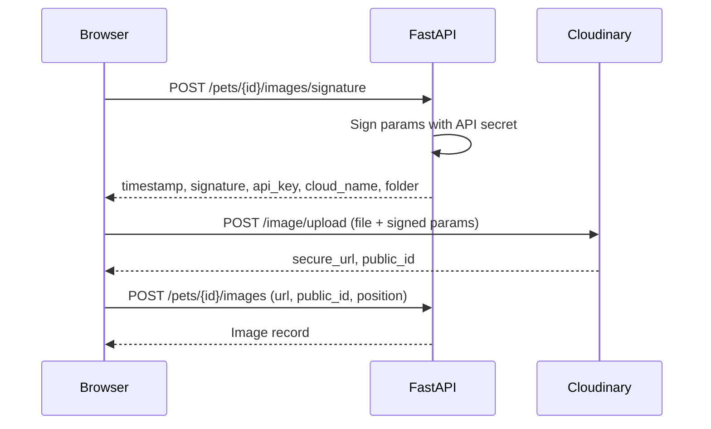

# API Design — Petfolio

**Framework:** FastAPI · **Base path:** `/api/v1` · **Format:** JSON
**Interactive docs:** `/docs` (Swagger) and `/redoc`, auto-generated from Pydantic schemas
**Related docs:** [PRD.md](PRD.md) · [DATABASE.md](DATABASE.md) · [ARCHITECTURE.md](ARCHITECTURE.md)

---

## 1. Conventions

### 1.1 Auth column

Every endpoint table below has an **Auth** column:

| Value      | Meaning                                                   |
| ---------- | --------------------------------------------------------- |
| `public`   | No authentication required                                |
| `user`     | Valid access token required                               |
| `verified` | Valid access token **and** `is_verified = true`           |
| `owner`    | Authenticated **and** the caller owns the target resource |

### 1.2 Error envelope

Every 4xx and 5xx response uses the same shape:

```json
{
  "error": {
    "code": "PET_NOT_FOUND",
    "message": "This pet listing no longer exists.",
    "details": null
  }
}
```

`message` is safe to display to the user directly. `details` carries per-field errors on validation failures:

```json
{
  "error": {
    "code": "VALIDATION_ERROR",
    "message": "Some fields need attention.",
    "details": {
      "email": "Enter a valid email address.",
      "password": "Password must be at least 8 characters."
    }
  }
}
```

### 1.3 Status codes

| Code  | Used for                                                         |
| ----- | ---------------------------------------------------------------- |
| `200` | Successful read or update                                        |
| `201` | Resource created                                                 |
| `204` | Successful delete, no body                                       |
| `400` | Malformed request or invalid state transition                    |
| `401` | Missing, expired, or invalid access token                        |
| `403` | Authenticated but not permitted (not the owner, or not verified) |
| `404` | Resource does not exist, or the caller may not know that it does |
| `409` | Conflict — duplicate email, duplicate application                |
| `422` | Pydantic validation failure                                      |
| `429` | Rate limit exceeded                                              |
| `500` | Unhandled server error                                           |

### 1.4 Error codes

| Code                          | HTTP | Meaning                                                 |
| ----------------------------- | ---- | ------------------------------------------------------- |
| `VALIDATION_ERROR`            | 422  | Field validation failed                                 |
| `INVALID_CREDENTIALS`         | 401  | Wrong email or password                                 |
| `NOT_AUTHENTICATED`           | 401  | No valid access token                                   |
| `TOKEN_EXPIRED`               | 401  | Access token expired — client should refresh            |
| `REFRESH_INVALID`             | 401  | Refresh token missing, expired, or revoked              |
| `EMAIL_ALREADY_REGISTERED`    | 409  | Email is taken                                          |
| `EMAIL_NOT_VERIFIED`          | 403  | Action requires a verified email                        |
| `INVALID_TOKEN`               | 400  | Verification or reset token is bad, expired, or used    |
| `NOT_OWNER`                   | 403  | Caller does not own this resource                       |
| `PET_NOT_FOUND`               | 404  |                                                         |
| `PET_NOT_AVAILABLE`           | 400  | Pet is already adopted                                  |
| `APPLICATION_NOT_FOUND`       | 404  |                                                         |
| `ALREADY_APPLIED`             | 409  | One application per pet per adopter                     |
| `CANNOT_APPLY_OWN_PET`        | 400  | Owner cannot apply to their own listing                 |
| `APPLICATION_ALREADY_DECIDED` | 400  | Only `pending` applications can be accepted or rejected |
| `IMAGE_LIMIT_REACHED`         | 400  | Maximum 8 images per pet                                |
| `IMAGE_REQUIRED`              | 400  | A listing must keep at least 1 image                    |
| `RATE_LIMITED`                | 429  | Too many requests                                       |

### 1.5 Pagination

Offset-based, uniform across all list endpoints:

**Request:** `?page=1&limit=12` (`page` ≥ 1, `limit` 1–50, default 12)

**Response:**

```json
{
  "items": [ ... ],
  "pagination": {
    "page": 1,
    "limit": 12,
    "total": 87,
    "total_pages": 8,
    "has_next": true,
    "has_prev": false
  }
}
```

> Offset pagination is chosen over cursors because the browse UI needs page numbers and a total count, and the dataset size makes deep-offset cost irrelevant.

### 1.6 Auth cookies

| Cookie          | Contents                                                       | Lifetime   | Flags                                                     |
| --------------- | -------------------------------------------------------------- | ---------- | --------------------------------------------------------- |
| `access_token`  | JWT with `sub`, `email`, `is_verified`, `exp`                  | 15 minutes | `HttpOnly`, `Secure`, `SameSite=Lax`, `Path=/`            |
| `refresh_token` | Opaque random string (SHA-256 hash stored in `refresh_tokens`) | 7 days     | `HttpOnly`, `Secure`, `SameSite=Lax`, `Path=/api/v1/auth` |

The refresh cookie is scoped to the auth path so it is never sent on ordinary requests. `SameSite=Lax` plus the fact that all state-changing endpoints are non-GET is the CSRF defense; no separate CSRF token in v1. Every browser request uses `credentials: "include"`.

**Refresh flow:** on a `401 TOKEN_EXPIRED`, the client calls `POST /auth/refresh` once and retries the original request. If refresh also fails, cookies are cleared and the user is sent to `/login`. Concurrent 401s share a single in-flight refresh promise.

### 1.7 Rate limits

Per IP, sliding window:

| Scope                                                     | Limit        |
| --------------------------------------------------------- | ------------ |
| `POST /auth/login`                                        | 10 / 15 min  |
| `POST /auth/register`                                     | 5 / hour     |
| `POST /auth/forgot-password`, `/auth/resend-verification` | 3 / hour     |
| `POST /pets`                                              | 10 / hour    |
| `POST /pets/{id}/applications`                            | 20 / day     |
| Everything else                                           | 100 / minute |

---

## 2. Shared Response Objects

### `UserPublic` — anyone can see this

```json
{
  "id": "uuid",
  "full_name": "Priya Sharma",
  "avatar_url": "https://res.cloudinary.com/...",
  "city": "Pune",
  "bio": "Dog person, plant killer.",
  "created_at": "2026-01-14T09:20:00Z"
}
```

### `UserPrivate` — only the user themselves

`UserPublic` plus `email`, `phone`, `is_verified`, `updated_at`.

### `UserContact` — released only on an accepted application (FR-PROF-5)

`UserPublic` plus `email` and `phone`.

### `PetCard` — the list projection

```json
{
  "id": "uuid",
  "name": "Bruno",
  "species": "dog",
  "breed": "Labrador",
  "gender": "male",
  "size": "medium",
  "age_value": 2,
  "age_unit": "years",
  "city": "Pune",
  "status": "available",
  "cover_image_url": "https://res.cloudinary.com/...",
  "is_favorited": false,
  "created_at": "2026-08-02T11:00:00Z"
}
```

`is_favorited` is `false` for anonymous callers and reflects the caller's own favorites when authenticated.

### `PetDetail` — the detail projection

`PetCard` plus:

```json
{
  "description": "Bruno is calm indoors and loves long evening walks...",
  "is_vaccinated": true,
  "is_neutered": true,
  "good_with_notes": "Great with children, wary of other male dogs.",
  "images": [
    { "id": "uuid", "url": "https://...", "position": 0 },
    { "id": "uuid", "url": "https://...", "position": 1 }
  ],
  "owner": { "...UserPublic..." },
  "application_count": 4,
  "viewer_application": { "id": "uuid", "status": "pending" },
  "updated_at": "2026-08-05T08:15:00Z"
}
```

`application_count` is returned only to the owner. `viewer_application` is present only when the caller has applied — it drives the button state described in FR-DISC-9.

### `ApplicationSummary`

```json
{
  "id": "uuid",
  "status": "pending",
  "created_at": "2026-08-10T14:30:00Z",
  "decided_at": null,
  "pet": {
    "id": "uuid",
    "name": "Bruno",
    "cover_image_url": "https://...",
    "status": "available"
  }
}
```

### `ApplicationDetail`

`ApplicationSummary` plus the answers (`message`, `living_situation`, `has_other_pets`, `experience`, `contact_phone`) and an `adopter` object. `adopter` is `UserPublic` while pending or rejected, and `UserContact` once accepted. On the adopter's own view, an accepted application also carries `owner_contact` as `UserContact`.

---

## 3. Authentication Endpoints

| Method | Path                        | Auth   | Purpose                                    | FR        |
| ------ | --------------------------- | ------ | ------------------------------------------ | --------- |
| POST   | `/auth/register`            | public | Create an account, send verification email | FR-AUTH-1 |
| POST   | `/auth/login`               | public | Authenticate, set cookies                  | FR-AUTH-4 |
| POST   | `/auth/refresh`             | cookie | Rotate tokens                              | FR-AUTH-8 |
| POST   | `/auth/logout`              | user   | Clear cookies, revoke refresh token        | FR-AUTH-6 |
| POST   | `/auth/verify-email`        | public | Redeem a verification token                | FR-AUTH-2 |
| POST   | `/auth/resend-verification` | public | Issue a new verification email             | FR-AUTH-3 |
| POST   | `/auth/forgot-password`     | public | Send a reset email                         | FR-AUTH-7 |
| POST   | `/auth/reset-password`      | public | Set a new password with a reset token      | FR-AUTH-7 |
| GET    | `/auth/me`                  | user   | Current user, for session bootstrap        | FR-AUTH-8 |

### `POST /auth/register` → `201`

```json
// request
{ "full_name": "Priya Sharma", "email": "priya@example.com", "password": "correcthorse" }

// response
{ "message": "Account created. Check your email to verify your account.", "user": { "...UserPrivate..." } }
```

Password: minimum 8 characters. Hashed with Argon2id. Cookies are **not** set — the user must verify, then log in. Errors: `409 EMAIL_ALREADY_REGISTERED`, `422 VALIDATION_ERROR`.

### `POST /auth/login` → `200`

```json
// request
{ "email": "priya@example.com", "password": "correcthorse" }

// response — plus Set-Cookie: access_token, refresh_token
{ "user": { "...UserPrivate..." } }
```

Unverified users **can** log in (they need the app to resend verification and edit their profile) — verification is enforced per-action, not at login. Errors: `401 INVALID_CREDENTIALS` for both a wrong password and an unknown email, worded identically so the endpoint does not confirm which emails are registered. `429 RATE_LIMITED`.

### `POST /auth/refresh` → `200`

No body. Reads the `refresh_token` cookie, validates it against `refresh_tokens`, revokes it, issues a new pair (rotation), and returns `{ "user": {...UserPrivate...} }`. Errors: `401 REFRESH_INVALID`.

### `POST /auth/logout` → `204`

Revokes the current refresh token and clears both cookies. Idempotent — succeeds even with no valid session.

### `POST /auth/verify-email` → `200`

```json
// request
{ "token": "raw-token-from-email-link" }

// response
{ "message": "Email verified. You can now sign in." }
```

Validates the hash against `email_tokens` where `type = 'verification'`, `used_at IS NULL`, `expires_at > now()`. Sets `users.is_verified = true` and stamps `used_at`. Errors: `400 INVALID_TOKEN`.

### `POST /auth/resend-verification` → `200`

Body `{ "email": "..." }`. Marks prior unused verification tokens used, issues a new one, sends E1. Always returns the same message regardless of whether the account exists or is already verified.

### `POST /auth/forgot-password` → `200`

Body `{ "email": "..." }`. Always: `{ "message": "If an account exists for that email, we've sent a reset link." }`.

### `POST /auth/reset-password` → `200`

```json
{ "token": "raw-token", "password": "newpassword123" }
```

Updates the hash, stamps `used_at`, and revokes **all** refresh tokens for that user. Errors: `400 INVALID_TOKEN`, `422 VALIDATION_ERROR`.

### `GET /auth/me` → `200`

Returns `{ "user": {...UserPrivate...} }`. Called once on app load to hydrate auth state. Errors: `401 NOT_AUTHENTICATED`.

---

## 4. Profile Endpoints

| Method | Path                         | Auth   | Purpose                                    | FR        |
| ------ | ---------------------------- | ------ | ------------------------------------------ | --------- |
| GET    | `/users/me`                  | user   | Own full profile                           | FR-PROF-2 |
| PATCH  | `/users/me`                  | user   | Update own profile                         | FR-PROF-2 |
| POST   | `/users/me/avatar/signature` | user   | Cloudinary signature for the avatar upload | FR-PROF-3 |
| POST   | `/users/me/avatar`           | user   | Persist the uploaded avatar                | FR-PROF-3 |
| GET    | `/users/{id}`                | public | Public profile                             | FR-PROF-4 |
| GET    | `/users/{id}/pets`           | public | That user's available listings             | FR-PROF-4 |

### `PATCH /users/me` → `200`

```json
{
  "full_name": "Priya S.",
  "city": "Pune",
  "phone": "+91...",
  "bio": "Dog person."
}
```

All fields optional; only provided fields change. Email is not editable in v1 — including it returns `422`.

### `POST /users/me/avatar/signature` → `200`

Returns `{ "timestamp", "signature", "api_key", "cloud_name", "folder": "adopt-a-pet/avatars" }`. The browser uploads directly to Cloudinary with these.

### `POST /users/me/avatar` → `200`

```json
{
  "url": "https://res.cloudinary.com/...",
  "public_id": "adopt-a-pet/avatars/abc123"
}
```

Stores both, and deletes the previous avatar from Cloudinary. Returns `UserPrivate`.

### `GET /users/{id}` → `200`

Returns `UserPublic` only. **Never** `email` or `phone` (FR-PROF-4). Errors: `404`.

### `GET /users/{id}/pets` → `200`

Paginated `PetCard` list, `status = available` only.

---

## 5. Pet Listing Endpoints

| Method | Path                      | Auth     | Purpose                           | FR            |
| ------ | ------------------------- | -------- | --------------------------------- | ------------- |
| GET    | `/pets`                   | public   | Browse with filters, search, sort | FR-DISC-1,3–8 |
| POST   | `/pets`                   | verified | Create a listing                  | FR-PET-1      |
| GET    | `/pets/{id}`              | public   | Listing detail                    | FR-DISC-9     |
| PATCH  | `/pets/{id}`              | owner    | Edit a listing                    | FR-PET-3      |
| DELETE | `/pets/{id}`              | owner    | Delete a listing                  | FR-PET-4      |
| POST   | `/pets/{id}/mark-adopted` | owner    | Close the listing                 | FR-PET-7      |
| GET    | `/pets/mine`              | user     | The caller's own listings         | FR-PET-6      |

### `GET /pets` → `200`

Query parameters:

| Param      | Type   | Default  | Notes                                                                                                  |
| ---------- | ------ | -------- | ------------------------------------------------------------------------------------------------------ |
| `species`  | enum   | —        | `dog` \| `cat` \| `bird` \| `rabbit` \| `other`. Repeatable for multi-select.                          |
| `size`     | enum   | —        | `small` \| `medium` \| `large`. Repeatable.                                                            |
| `gender`   | enum   | —        | `male` \| `female` \| `unknown`                                                                        |
| `city`     | string | —        | Case-insensitive exact match                                                                           |
| `age_band` | enum   | —        | `baby` (<12 mo) \| `young` (12–35) \| `adult` (36–95) \| `senior` (96+), mapped onto `pets.age_months` |
| `q`        | string | —        | Full-text search over name, breed, description                                                         |
| `sort`     | enum   | `newest` | `newest` \| `oldest` \| `youngest`                                                                     |
| `page`     | int    | 1        |                                                                                                        |
| `limit`    | int    | 12       | Max 50                                                                                                 |

Only `status = available` is ever returned. Filters combine with AND; repeated values within one filter combine with OR. Response: `{ "items": [PetCard], "pagination": {...} }`.

**Route ordering note:** `/pets/mine` must be registered **before** `/pets/{id}` in the router, or FastAPI will try to parse `mine` as a UUID.

### `POST /pets` → `201`

```json
{
  "name": "Bruno",
  "species": "dog",
  "breed": "Labrador",
  "gender": "male",
  "size": "medium",
  "age_value": 2,
  "age_unit": "years",
  "city": "Pune",
  "description": "Bruno is calm indoors and loves long evening walks...",
  "is_vaccinated": true,
  "is_neutered": true,
  "good_with_notes": "Great with children.",
  "images": [
    {
      "url": "https://res.cloudinary.com/...",
      "public_id": "adopt-a-pet/pets/x1",
      "position": 0
    },
    {
      "url": "https://res.cloudinary.com/...",
      "public_id": "adopt-a-pet/pets/x2",
      "position": 1
    }
  ]
}
```

Required: `name`, `species`, `gender`, `size`, `age_value`, `age_unit`, `city`, `description`, and 1–8 `images`. Images are uploaded to Cloudinary first via the signature endpoint (§6). Pet and images are inserted in one transaction. Errors: `403 EMAIL_NOT_VERIFIED`, `422`, `400 IMAGE_REQUIRED`, `400 IMAGE_LIMIT_REACHED`.

### `GET /pets/{id}` → `200`

Returns `PetDetail`. Adopted pets are still reachable by direct link (so old links and the adopter's application history resolve) but never appear in `GET /pets`. Errors: `404 PET_NOT_FOUND`.

### `PATCH /pets/{id}` → `200`

Partial update of any create field except `images` (managed by the image endpoints) and `status`. Errors: `403 NOT_OWNER`, `404`, `422`.

### `DELETE /pets/{id}` → `204`

Deletes the pet; images cascade in Postgres and are also removed from Cloudinary. Any `pending` applications become `withdrawn`. Errors: `403 NOT_OWNER`, `404`.

### `POST /pets/{id}/mark-adopted` → `200`

No body. Sets `status = 'adopted'` and rejects every remaining `pending` application, sending E5 to each and E6 to the owner. Errors: `403 NOT_OWNER`, `400 PET_NOT_AVAILABLE` if already adopted.

### `GET /pets/mine` → `200`

The caller's listings in **every** status, newest first, each carrying an extra `application_count` and `pending_count` for the dashboard rows.

---

## 6. Image Endpoints

Images never pass through the API server. The browser gets a signature, uploads straight to Cloudinary, then tells the API where the file landed.



| Method | Path                           | Auth  | Purpose                   | FR       |
| ------ | ------------------------------ | ----- | ------------------------- | -------- |
| POST   | `/pets/{id}/images/signature`  | owner | Signed upload parameters  | FR-PET-2 |
| POST   | `/pets/{id}/images`            | owner | Persist an uploaded image | FR-PET-5 |
| DELETE | `/pets/{id}/images/{image_id}` | owner | Remove an image           | FR-PET-5 |
| PATCH  | `/pets/{id}/images/order`      | owner | Reorder / set the cover   | FR-PET-2 |

`POST .../images` body: `{ "url", "public_id", "position" }` → `201`. Rejects with `400 IMAGE_LIMIT_REACHED` at 8 images.

`DELETE .../images/{image_id}` → `204`. Deletes from Cloudinary and renumbers remaining positions so they stay contiguous from 0. Rejects with `400 IMAGE_REQUIRED` when it is the last image.

`PATCH .../images/order` body: `{ "image_ids": ["uuid-3", "uuid-1", "uuid-2"] }` → `200`. Assigns positions in array order; index 0 becomes the cover. The array must contain exactly the pet's current image IDs.

**Creating a listing:** the signature endpoint requires an existing pet, so the create flow signs against a neutral folder using `POST /pets/images/signature` (no pet ID, auth `verified`) and passes the resulting URLs inline to `POST /pets`.

---

## 7. Favorites Endpoints

| Method | Path                  | Auth | Purpose        | FR       |
| ------ | --------------------- | ---- | -------------- | -------- |
| POST   | `/pets/{id}/favorite` | user | Save a pet     | FR-FAV-1 |
| DELETE | `/pets/{id}/favorite` | user | Unsave a pet   | FR-FAV-4 |
| GET    | `/users/me/favorites` | user | The saved list | FR-FAV-3 |

`POST` → `201 { "is_favorited": true }`, idempotent — favoriting twice returns `200` with the same body rather than erroring, backed by the unique constraint.
`DELETE` → `204`, idempotent.
`GET` → paginated `PetCard` list, newest-saved first, `is_favorited` always `true`. Includes adopted pets, badged accordingly.

---

## 8. Adoption Application Endpoints

| Method | Path                        | Auth     | Purpose                          | FR       |
| ------ | --------------------------- | -------- | -------------------------------- | -------- |
| POST   | `/pets/{id}/applications`   | verified | Submit an application            | FR-APP-1 |
| GET    | `/pets/{id}/applications`   | owner    | Owner's inbox for one pet        | FR-APP-5 |
| GET    | `/users/me/applications`    | user     | Adopter's submitted applications | FR-APP-4 |
| GET    | `/applications/{id}`        | party    | One application in full          | FR-APP-9 |
| POST   | `/applications/{id}/accept` | owner    | Accept and close the listing     | FR-APP-6 |
| POST   | `/applications/{id}/reject` | owner    | Decline one applicant            | FR-APP-7 |

`party` = the applicant or the pet's owner. Anyone else gets `404`, not `403` — a third party should not learn that the application exists.

### `POST /pets/{id}/applications` → `201`

```json
{
  "message": "We have a fenced yard and I work from home...",
  "living_situation": "Independent house with a garden, 4 adults",
  "has_other_pets": false,
  "experience": "Grew up with two labs.",
  "contact_phone": "+91..."
}
```

Returns `ApplicationDetail`. Side effects: E3 email plus an `application_received` notification for the owner.

Errors: `403 EMAIL_NOT_VERIFIED` · `400 CANNOT_APPLY_OWN_PET` · `409 ALREADY_APPLIED` (response includes the existing application so the UI can show its status per FR-APP-3) · `400 PET_NOT_AVAILABLE` · `404 PET_NOT_FOUND`.

### `GET /pets/{id}/applications` → `200`

Paginated `ApplicationDetail` list, newest first, each with the applicant as `UserPublic` (or `UserContact` once accepted). Optional `?status=pending`. Errors: `403 NOT_OWNER`, `404`.

### `GET /users/me/applications` → `200`

Paginated `ApplicationSummary` list, newest first. Optional `?status=`.

### `POST /applications/{id}/accept` → `200`

No body. Runs the transaction in [DATABASE.md §7](DATABASE.md#7-the-accept-transaction): this application → `accepted`, all other pending on the pet → `rejected`, pet → `adopted`. After commit, sends E4 to the accepted adopter (with `UserContact` for the owner), E5 to each rejected adopter, E6 to the owner, and writes the matching notifications.

Returns the updated `ApplicationDetail`, now carrying `owner_contact`.

Errors: `403 NOT_OWNER` · `400 APPLICATION_ALREADY_DECIDED` · `400 PET_NOT_AVAILABLE`.

### `POST /applications/{id}/reject` → `200`

No body. Sets this application `rejected` and `decided_at = now()`. The pet and all other applications are untouched. Sends E5 and an `application_rejected` notification. Errors: `403 NOT_OWNER`, `400 APPLICATION_ALREADY_DECIDED`.

---

## 9. Notification Endpoints

| Method | Path                          | Auth | Purpose        | FR         |
| ------ | ----------------------------- | ---- | -------------- | ---------- |
| GET    | `/notifications`              | user | Paginated feed | FR-NOTIF-2 |
| GET    | `/notifications/unread-count` | user | Badge count    | FR-NOTIF-2 |
| POST   | `/notifications/{id}/read`    | user | Mark one read  | FR-NOTIF-3 |
| POST   | `/notifications/read-all`     | user | Mark all read  | FR-NOTIF-3 |

`GET /notifications` returns items shaped `{ id, type, title, body, link, is_read, created_at }`, newest first, with optional `?unread_only=true`. The badge count is polled on route change rather than on a timer — good enough for v1, and no websocket infrastructure.

---

## 10. Meta Endpoints

| Method | Path            | Auth   | Purpose                         |
| ------ | --------------- | ------ | ------------------------------- |
| GET    | `/health`       | public | Liveness probe for Render       |
| GET    | `/meta/filters` | public | Options for the filter controls |

`GET /health` → `{ "status": "ok", "database": "ok", "version": "1.0.0" }`.

`GET /meta/filters` → `200`:

```json
{
  "species": [
    { "value": "dog", "label": "Dogs", "count": 34 },
    { "value": "cat", "label": "Cats", "count": 21 }
  ],
  "sizes": [{ "value": "small", "label": "Small" }, "..."],
  "genders": [{ "value": "male", "label": "Male" }, "..."],
  "cities": ["Bengaluru", "Delhi", "Mumbai", "Pune"],
  "age_bands": [
    { "value": "baby", "label": "Under 1 year" },
    { "value": "young", "label": "1–3 years" },
    { "value": "adult", "label": "3–8 years" },
    { "value": "senior", "label": "8+ years" }
  ]
}
```

Counts and cities are computed over `status = 'available'` and cached for 5 minutes. This endpoint keeps enum labels and the city list out of the frontend, so adding a species is a backend-only change.

---

## 11. Endpoint Summary

| Group         | Count  | Paths                                                                      |
| ------------- | ------ | -------------------------------------------------------------------------- |
| Auth          | 9      | `/auth/*`                                                                  |
| Profile       | 6      | `/users/me*`, `/users/{id}*`                                               |
| Pets          | 7      | `/pets`, `/pets/{id}`, `/pets/mine`, `/pets/{id}/mark-adopted`             |
| Images        | 4      | `/pets/{id}/images*`                                                       |
| Favorites     | 3      | `/pets/{id}/favorite`, `/users/me/favorites`                               |
| Applications  | 6      | `/pets/{id}/applications`, `/applications/{id}*`, `/users/me/applications` |
| Notifications | 4      | `/notifications*`                                                          |
| Meta          | 2      | `/health`, `/meta/filters`                                                 |
| **Total**     | **41** |                                                                            |

---

## 12. Requirement Coverage

| Epic          | Requirements   | Covered by                                         |
| ------------- | -------------- | -------------------------------------------------- |
| Auth          | FR-AUTH-1 → 8  | §3 (all nine endpoints)                            |
| Profile       | FR-PROF-1 → 5  | §4, plus `UserContact` release in §8               |
| Listings      | FR-PET-1 → 7   | §5, §6                                             |
| Discovery     | FR-DISC-1 → 9  | `GET /pets`, `GET /pets/{id}`, `GET /meta/filters` |
| Favorites     | FR-FAV-1 → 5   | §7                                                 |
| Applications  | FR-APP-1 → 9   | §8                                                 |
| Notifications | FR-NOTIF-1 → 4 | §9, plus email side effects noted per endpoint     |
