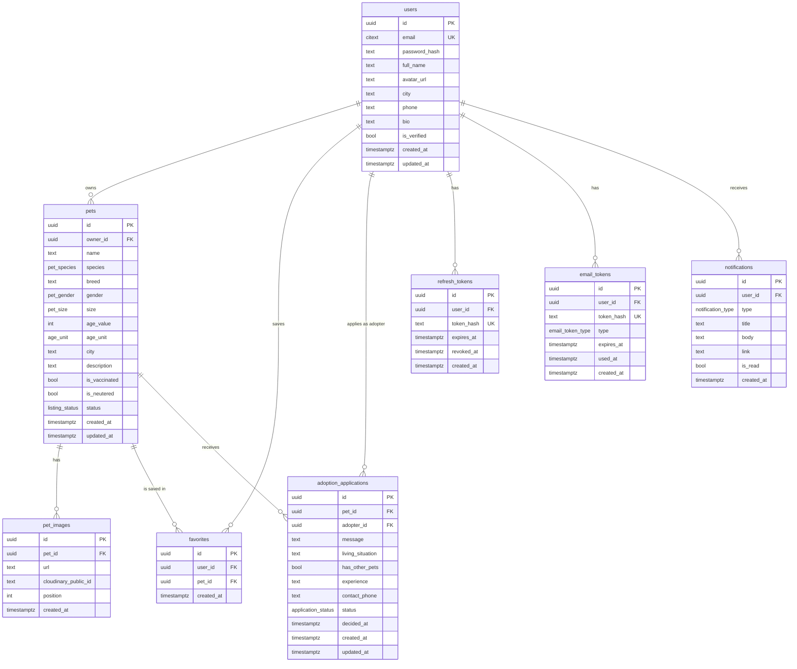

# Database Design — Adopt-a-Pet

**Database:** PostgreSQL 16
**ORM:** SQLAlchemy 2.0 (declarative, typed)
**Migrations:** Alembic
**Related docs:** [PRD.md](PRD.md) · [API.md](API.md) · [ARCHITECTURE.md](ARCHITECTURE.md)

---

## 1. Entity Relationship Diagram



---

## 2. Conventions

| Convention | Rule |
|---|---|
| Primary keys | `uuid` generated with `gen_random_uuid()` (pgcrypto). UUIDs keep IDs non-enumerable in public URLs. |
| Timestamps | `timestamptz`, always stored in UTC. `created_at` defaults to `now()`. |
| `updated_at` | Maintained by a shared `set_updated_at()` trigger on every table that has the column. |
| Naming | Tables plural snake_case, columns snake_case, enums singular (`pet_species`). |
| Text | `text` everywhere rather than `varchar(n)`; length limits are enforced by Pydantic at the API boundary. |
| Deletes | Hard deletes with `ON DELETE CASCADE`. Simple and sufficient for v1. |
| Email | `citext` so `Priya@x.com` and `priya@x.com` are the same account. |

**Required extensions:**

```sql
CREATE EXTENSION IF NOT EXISTS pgcrypto;  -- gen_random_uuid()
CREATE EXTENSION IF NOT EXISTS citext;    -- case-insensitive email
```

---

## 3. Enum Types

These exact values are used across the database, the API, and the frontend. Do not diverge.

```sql
CREATE TYPE pet_species        AS ENUM ('dog', 'cat', 'bird', 'rabbit', 'other');
CREATE TYPE pet_gender         AS ENUM ('male', 'female', 'unknown');
CREATE TYPE pet_size           AS ENUM ('small', 'medium', 'large');
CREATE TYPE age_unit           AS ENUM ('months', 'years');
CREATE TYPE listing_status     AS ENUM ('available', 'adopted');
CREATE TYPE application_status AS ENUM ('pending', 'accepted', 'rejected', 'withdrawn');
CREATE TYPE email_token_type   AS ENUM ('verification', 'password_reset');
CREATE TYPE notification_type  AS ENUM (
    'application_received',
    'application_accepted',
    'application_rejected',
    'pet_adopted'
);
```

> `withdrawn` exists in `application_status` so applications closed by a listing deletion have a terminal state that is not a rejection by the owner. No v1 UI creates it directly.

---

## 4. Tables

### 4.1 `users`

Every person with an account. Roles are contextual, not stored — you are an owner of the pets you created and an adopter on the applications you submitted.

| Column | Type | Null | Default | Notes |
|---|---|---|---|---|
| `id` | uuid | no | `gen_random_uuid()` | PK |
| `email` | citext | no | — | Unique. Login identifier. Never exposed publicly. |
| `password_hash` | text | no | — | Argon2id. Never leaves the backend. |
| `full_name` | text | no | — | Shown publicly |
| `avatar_url` | text | yes | `null` | Cloudinary URL |
| `avatar_public_id` | text | yes | `null` | Cloudinary public ID, needed to delete the old avatar on replace |
| `city` | text | yes | `null` | Free text in v1 |
| `phone` | text | yes | `null` | Revealed only on an accepted application |
| `bio` | text | yes | `null` | Shown publicly |
| `is_verified` | boolean | no | `false` | Gates listing creation and applications (FR-AUTH-5) |
| `created_at` | timestamptz | no | `now()` | "Member since" |
| `updated_at` | timestamptz | no | `now()` | Trigger-maintained |

```sql
CREATE TABLE users (
    id               uuid PRIMARY KEY DEFAULT gen_random_uuid(),
    email            citext NOT NULL,
    password_hash    text NOT NULL,
    full_name        text NOT NULL,
    avatar_url       text,
    avatar_public_id text,
    city             text,
    phone            text,
    bio              text,
    is_verified      boolean NOT NULL DEFAULT false,
    created_at       timestamptz NOT NULL DEFAULT now(),
    updated_at       timestamptz NOT NULL DEFAULT now(),
    CONSTRAINT users_email_key UNIQUE (email)
);
```

---

### 4.2 `pets`

One row per listing.

| Column | Type | Null | Default | Notes |
|---|---|---|---|---|
| `id` | uuid | no | `gen_random_uuid()` | PK |
| `owner_id` | uuid | no | — | FK → `users.id`, `ON DELETE CASCADE` |
| `name` | text | no | — | Pet's name |
| `species` | pet_species | no | — | Primary filter (FR-DISC-4) |
| `breed` | text | yes | `null` | Free text, searchable |
| `gender` | pet_gender | no | `'unknown'` | |
| `size` | pet_size | no | — | |
| `age_value` | integer | no | — | Paired with `age_unit`; `> 0` |
| `age_unit` | age_unit | no | — | `months` or `years` |
| `age_months` | integer | no | — | Generated: normalized age for sorting and age-band filtering |
| `city` | text | no | — | Free text in v1 |
| `description` | text | no | — | Searchable |
| `is_vaccinated` | boolean | yes | `null` | `null` = owner didn't say |
| `is_neutered` | boolean | yes | `null` | `null` = owner didn't say |
| `good_with_notes` | text | yes | `null` | Free text ("fine with kids, wary of other dogs") |
| `status` | listing_status | no | `'available'` | `adopted` hides it from browse |
| `created_at` | timestamptz | no | `now()` | Default sort key |
| `updated_at` | timestamptz | no | `now()` | Trigger-maintained |

```sql
CREATE TABLE pets (
    id              uuid PRIMARY KEY DEFAULT gen_random_uuid(),
    owner_id        uuid NOT NULL REFERENCES users(id) ON DELETE CASCADE,
    name            text NOT NULL,
    species         pet_species NOT NULL,
    breed           text,
    gender          pet_gender NOT NULL DEFAULT 'unknown',
    size            pet_size NOT NULL,
    age_value       integer NOT NULL,
    age_unit        age_unit NOT NULL,
    age_months      integer GENERATED ALWAYS AS (
                        CASE WHEN age_unit = 'years' THEN age_value * 12
                             ELSE age_value END
                    ) STORED,
    city            text NOT NULL,
    description     text NOT NULL,
    is_vaccinated   boolean,
    is_neutered     boolean,
    good_with_notes text,
    status          listing_status NOT NULL DEFAULT 'available',
    created_at      timestamptz NOT NULL DEFAULT now(),
    updated_at      timestamptz NOT NULL DEFAULT now(),
    CONSTRAINT pets_age_value_positive CHECK (age_value > 0)
);
```

**Why `age_months` is generated:** the UI lets an owner say "8 months" or "3 years", but browse needs to sort and band by a single comparable number. Computing it in the database keeps it always correct and indexable, with no application logic to forget.

---

### 4.3 `pet_images`

One row per photo. Minimum 1 and maximum 8 per pet are enforced in the service layer.

| Column | Type | Null | Default | Notes |
|---|---|---|---|---|
| `id` | uuid | no | `gen_random_uuid()` | PK |
| `pet_id` | uuid | no | — | FK → `pets.id`, `ON DELETE CASCADE` |
| `url` | text | no | — | Cloudinary secure URL |
| `cloudinary_public_id` | text | no | — | Needed to delete from Cloudinary |
| `position` | integer | no | `0` | `position = 0` is the cover image |
| `created_at` | timestamptz | no | `now()` | |

```sql
CREATE TABLE pet_images (
    id                   uuid PRIMARY KEY DEFAULT gen_random_uuid(),
    pet_id               uuid NOT NULL REFERENCES pets(id) ON DELETE CASCADE,
    url                  text NOT NULL,
    cloudinary_public_id text NOT NULL,
    position             integer NOT NULL DEFAULT 0,
    created_at           timestamptz NOT NULL DEFAULT now(),
    CONSTRAINT pet_images_position_unique UNIQUE (pet_id, position) DEFERRABLE INITIALLY DEFERRED
);
```

The unique constraint is `DEFERRABLE` so a reorder can renumber positions inside one transaction without tripping on an intermediate collision.

---

### 4.4 `favorites`

Join table. Private to the user who created the row (FR-FAV-5).

| Column | Type | Null | Default | Notes |
|---|---|---|---|---|
| `id` | uuid | no | `gen_random_uuid()` | PK |
| `user_id` | uuid | no | — | FK → `users.id`, `ON DELETE CASCADE` |
| `pet_id` | uuid | no | — | FK → `pets.id`, `ON DELETE CASCADE` |
| `created_at` | timestamptz | no | `now()` | Sort key for the saved list |

```sql
CREATE TABLE favorites (
    id         uuid PRIMARY KEY DEFAULT gen_random_uuid(),
    user_id    uuid NOT NULL REFERENCES users(id) ON DELETE CASCADE,
    pet_id     uuid NOT NULL REFERENCES pets(id) ON DELETE CASCADE,
    created_at timestamptz NOT NULL DEFAULT now(),
    CONSTRAINT favorites_user_pet_unique UNIQUE (user_id, pet_id)
);
```

The unique constraint makes favoriting idempotent — a double click cannot create two rows (FR-FAV-1).

---

### 4.5 `adoption_applications`

One row per (pet, adopter) pair. The answer fields mirror the application form in FR-APP-1.

| Column | Type | Null | Default | Notes |
|---|---|---|---|---|
| `id` | uuid | no | `gen_random_uuid()` | PK |
| `pet_id` | uuid | no | — | FK → `pets.id`, `ON DELETE CASCADE` |
| `adopter_id` | uuid | no | — | FK → `users.id`, `ON DELETE CASCADE` |
| `message` | text | no | — | "Why do you want to adopt this pet?" |
| `living_situation` | text | no | — | Home type, space, household |
| `has_other_pets` | boolean | no | — | |
| `experience` | text | yes | `null` | Prior pet experience |
| `contact_phone` | text | no | — | Revealed to the owner only on acceptance |
| `status` | application_status | no | `'pending'` | |
| `decided_at` | timestamptz | yes | `null` | Set when status leaves `pending` |
| `created_at` | timestamptz | no | `now()` | "Submitted on" |
| `updated_at` | timestamptz | no | `now()` | Trigger-maintained |

```sql
CREATE TABLE adoption_applications (
    id               uuid PRIMARY KEY DEFAULT gen_random_uuid(),
    pet_id           uuid NOT NULL REFERENCES pets(id) ON DELETE CASCADE,
    adopter_id       uuid NOT NULL REFERENCES users(id) ON DELETE CASCADE,
    message          text NOT NULL,
    living_situation text NOT NULL,
    has_other_pets   boolean NOT NULL,
    experience       text,
    contact_phone    text NOT NULL,
    status           application_status NOT NULL DEFAULT 'pending',
    decided_at       timestamptz,
    created_at       timestamptz NOT NULL DEFAULT now(),
    updated_at       timestamptz NOT NULL DEFAULT now(),
    CONSTRAINT applications_pet_adopter_unique UNIQUE (pet_id, adopter_id)
);
```

**`UNIQUE (pet_id, adopter_id)`** is what implements FR-APP-3 — one application per pet per adopter, guaranteed at the database level rather than by a check the API might race past.

---

### 4.6 `refresh_tokens`

One row per issued refresh token. Storing them lets logout and password reset actually invalidate sessions (FR-AUTH-6, FR-AUTH-7).

| Column | Type | Null | Default | Notes |
|---|---|---|---|---|
| `id` | uuid | no | `gen_random_uuid()` | PK |
| `user_id` | uuid | no | — | FK → `users.id`, `ON DELETE CASCADE` |
| `token_hash` | text | no | — | SHA-256 of the token. **The raw token is never stored.** |
| `expires_at` | timestamptz | no | — | Issue time + 7 days |
| `revoked_at` | timestamptz | yes | `null` | Set on logout, rotation, or password reset |
| `created_at` | timestamptz | no | `now()` | |

```sql
CREATE TABLE refresh_tokens (
    id         uuid PRIMARY KEY DEFAULT gen_random_uuid(),
    user_id    uuid NOT NULL REFERENCES users(id) ON DELETE CASCADE,
    token_hash text NOT NULL,
    expires_at timestamptz NOT NULL,
    revoked_at timestamptz,
    created_at timestamptz NOT NULL DEFAULT now(),
    CONSTRAINT refresh_tokens_hash_unique UNIQUE (token_hash)
);
```

A token is valid only when `revoked_at IS NULL AND expires_at > now()`.

---

### 4.7 `email_tokens`

Backs both email verification and password reset. One table, distinguished by `type` — the lifecycle is identical apart from TTL.

| Column | Type | Null | Default | Notes |
|---|---|---|---|---|
| `id` | uuid | no | `gen_random_uuid()` | PK |
| `user_id` | uuid | no | — | FK → `users.id`, `ON DELETE CASCADE` |
| `token_hash` | text | no | — | SHA-256 of the token sent in the email |
| `type` | email_token_type | no | — | `verification` (24 h) or `password_reset` (1 h) |
| `expires_at` | timestamptz | no | — | |
| `used_at` | timestamptz | yes | `null` | Set on redemption — makes tokens single-use |
| `created_at` | timestamptz | no | `now()` | |

```sql
CREATE TABLE email_tokens (
    id         uuid PRIMARY KEY DEFAULT gen_random_uuid(),
    user_id    uuid NOT NULL REFERENCES users(id) ON DELETE CASCADE,
    token_hash text NOT NULL,
    type       email_token_type NOT NULL,
    expires_at timestamptz NOT NULL,
    used_at    timestamptz,
    created_at timestamptz NOT NULL DEFAULT now(),
    CONSTRAINT email_tokens_hash_unique UNIQUE (token_hash)
);
```

Issuing a new token of a given type marks any earlier unused token of that type for that user as used (FR-AUTH-3).

---

### 4.8 `notifications`

In-app notification feed (FR-NOTIF-2). Written in the same transaction as the event that caused it, so the bell and the email never disagree.

| Column | Type | Null | Default | Notes |
|---|---|---|---|---|
| `id` | uuid | no | `gen_random_uuid()` | PK |
| `user_id` | uuid | no | — | FK → `users.id`, `ON DELETE CASCADE`. The recipient. |
| `type` | notification_type | no | — | Drives the icon |
| `title` | text | no | — | One line, e.g. "New request for Bruno" |
| `body` | text | yes | `null` | Optional second line |
| `link` | text | no | — | Relative frontend path to open |
| `is_read` | boolean | no | `false` | |
| `created_at` | timestamptz | no | `now()` | Sort key, newest first |

```sql
CREATE TABLE notifications (
    id         uuid PRIMARY KEY DEFAULT gen_random_uuid(),
    user_id    uuid NOT NULL REFERENCES users(id) ON DELETE CASCADE,
    type       notification_type NOT NULL,
    title      text NOT NULL,
    body       text,
    link       text NOT NULL,
    is_read    boolean NOT NULL DEFAULT false,
    created_at timestamptz NOT NULL DEFAULT now()
);
```

---

## 5. Indexes

Every index below exists because a specific query needs it.

```sql
-- Browse: the hot path. Filter on status + species + city, sort by newest.
CREATE INDEX idx_pets_browse
    ON pets (status, species, city, created_at DESC);

-- Browse without a species filter, and the landing page's "recent pets".
CREATE INDEX idx_pets_status_created
    ON pets (status, created_at DESC);

-- Age-band filter and "youngest first" sort.
CREATE INDEX idx_pets_age
    ON pets (status, age_months);

-- "My Listings" and the owner's public profile listings.
CREATE INDEX idx_pets_owner
    ON pets (owner_id, created_at DESC);

-- Keyword search across name, breed, description (FR-DISC-7).
CREATE INDEX idx_pets_search
    ON pets USING GIN (
        to_tsvector('english', name || ' ' || coalesce(breed, '') || ' ' || description)
    );

-- Gallery fetch, always ordered by position.
CREATE INDEX idx_pet_images_pet
    ON pet_images (pet_id, position);

-- Saved pets list.
CREATE INDEX idx_favorites_user
    ON favorites (user_id, created_at DESC);

-- Owner's application inbox for one pet.
CREATE INDEX idx_applications_pet
    ON adoption_applications (pet_id, created_at DESC);

-- Adopter's "My Applications".
CREATE INDEX idx_applications_adopter
    ON adoption_applications (adopter_id, created_at DESC);

-- Accept flow: find remaining pending applications on a pet.
CREATE INDEX idx_applications_pending
    ON adoption_applications (pet_id) WHERE status = 'pending';

-- Session validation and bulk revocation.
CREATE INDEX idx_refresh_tokens_user
    ON refresh_tokens (user_id) WHERE revoked_at IS NULL;

-- Token redemption and invalidating prior tokens.
CREATE INDEX idx_email_tokens_user_type
    ON email_tokens (user_id, type) WHERE used_at IS NULL;

-- Notification dropdown and unread badge.
CREATE INDEX idx_notifications_user
    ON notifications (user_id, created_at DESC);
CREATE INDEX idx_notifications_unread
    ON notifications (user_id) WHERE is_read = false;
```

Unique constraints already create their own indexes (`users.email`, `favorites (user_id, pet_id)`, `adoption_applications (pet_id, adopter_id)`, both token hashes) — they are not repeated here.

---

## 6. The `updated_at` Trigger

One function, reused on every table with an `updated_at` column.

```sql
CREATE OR REPLACE FUNCTION set_updated_at()
RETURNS trigger AS $$
BEGIN
    NEW.updated_at = now();
    RETURN NEW;
END;
$$ LANGUAGE plpgsql;

CREATE TRIGGER users_set_updated_at
    BEFORE UPDATE ON users
    FOR EACH ROW EXECUTE FUNCTION set_updated_at();

CREATE TRIGGER pets_set_updated_at
    BEFORE UPDATE ON pets
    FOR EACH ROW EXECUTE FUNCTION set_updated_at();

CREATE TRIGGER applications_set_updated_at
    BEFORE UPDATE ON adoption_applications
    FOR EACH ROW EXECUTE FUNCTION set_updated_at();
```

---

## 7. The Accept Transaction

FR-APP-6 is the one place where several rows must change together. It runs as a single transaction:

```sql
BEGIN;

-- Lock the pet row so two concurrent accepts cannot both succeed.
SELECT id, status FROM pets WHERE id = :pet_id FOR UPDATE;
-- Service layer aborts here if status <> 'available'.

UPDATE adoption_applications
   SET status = 'accepted', decided_at = now()
 WHERE id = :application_id AND status = 'pending';
-- Service layer aborts if 0 rows updated (already decided).

UPDATE adoption_applications
   SET status = 'rejected', decided_at = now()
 WHERE pet_id = :pet_id
   AND id <> :application_id
   AND status = 'pending';

UPDATE pets SET status = 'adopted' WHERE id = :pet_id;

INSERT INTO notifications (user_id, type, title, link) VALUES (...);

COMMIT;
```

Emails are queued **after** the commit — never inside the transaction — so a mail failure cannot roll back an adoption, and a rollback cannot send a false acceptance.

---

## 8. Migrations (Alembic)

### Setup

```
backend/
├─ alembic.ini
├─ alembic/
│  ├─ env.py              # imports Base.metadata from app.models
│  └─ versions/
│     ├─ 0001_extensions_and_enums.py
│     ├─ 0002_users_and_tokens.py
│     ├─ 0003_pets_and_images.py
│     ├─ 0004_favorites_and_applications.py
│     ├─ 0005_notifications.py
│     └─ 0006_indexes_and_triggers.py
```

### Rules

| Rule | Reason |
|---|---|
| One logical change per migration, with a descriptive slug | Readable history, clean rollbacks |
| Every migration implements `downgrade()` | Reversible deploys |
| Autogenerate, then **always read and edit** the result | Alembic misses enum changes, generated columns, partial indexes, and triggers |
| Enums are created in the first migration and altered explicitly afterwards | Postgres enum changes are not automatic |
| Migrations run on deploy, before the app starts | Schema always leads the code |

Common commands:

```bash
alembic revision --autogenerate -m "add pets table"
alembic upgrade head
alembic downgrade -1
alembic current
```

---

## 9. Seed Data for Local Development

`backend/scripts/seed.py` — idempotent, truncates and reloads. Run with `python -m scripts.seed`.

| Data | Amount | Detail |
|---|---|---|
| Users | 8 | All verified, password `Password123!`. Two designated as heavy listers. `owner@test.com` and `adopter@test.com` are the fixed accounts for manual testing. |
| Pets | 30 | Spread across all five species, all sizes and genders, ages from 2 months to 11 years, 6 different cities. 25 `available`, 5 `adopted`. |
| Pet images | 2–5 per pet | Cloudinary demo URLs, `position` starting at 0 |
| Favorites | ~20 | Random user/pet pairs |
| Applications | ~15 | Mixed statuses across several pets, including one pet with 4 pending applications for exercising the accept flow |
| Notifications | ~10 | Mix of read and unread for `owner@test.com` |

The seed must produce enough variety that every filter combination and every empty state can be exercised without touching production data.

---

## 10. Requirement Traceability

| Table | Requirements it serves |
|---|---|
| `users` | FR-AUTH-1, 4, 5, 7 · FR-PROF-1 → 5 |
| `refresh_tokens` | FR-AUTH-6, 7, 8 |
| `email_tokens` | FR-AUTH-2, 3, 7 |
| `pets` | FR-PET-1 → 7 · FR-DISC-1 → 9 |
| `pet_images` | FR-PET-2, 5 · FR-DISC-2, 9 |
| `favorites` | FR-FAV-1 → 5 |
| `adoption_applications` | FR-APP-1 → 9 · FR-PROF-5 |
| `notifications` | FR-NOTIF-2, 3 |
