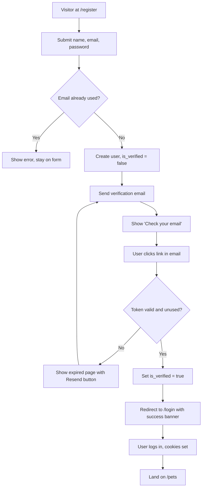
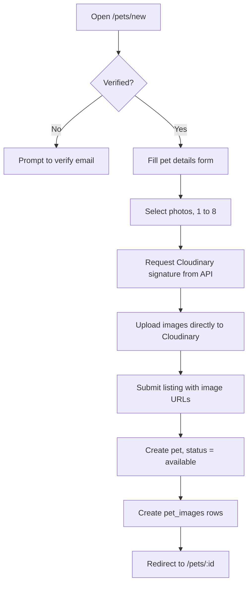
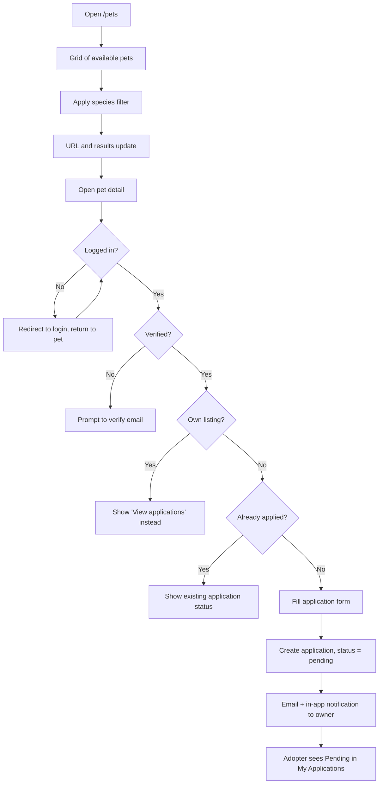
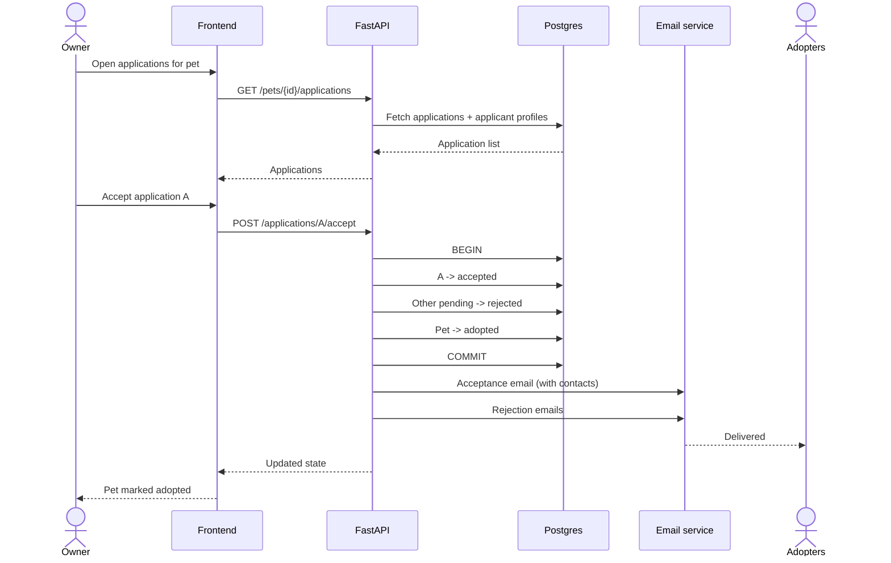
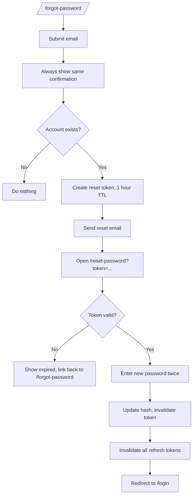

# Product Requirements Document — Adopt-a-Pet

**Version:** 1.0 (MVP)
**Status:** Approved for build
**Related docs:** [DATABASE.md](DATABASE.md) · [API.md](API.md) · [ARCHITECTURE.md](ARCHITECTURE.md) · [ROADMAP.md](ROADMAP.md)

---

## 1. Executive Summary

Adopt-a-Pet is a web portal that connects people who need to rehome a pet with people who want to adopt one.

An owner creates a listing with photos and details about their pet. Adopters browse the catalog, filter by animal type, save favorites, and submit an adoption application. The owner reviews the applications in one inbox, accepts one adopter, and marks the pet adopted. Both sides get email notifications at each step.

The product is deliberately narrow. It does one thing: **move a pet from an owner who can no longer keep it to an adopter who wants it, with a clear paper trail on both sides.** There is no messaging, no payments, no shelter accounts, and no marketplace mechanics in v1.

**We are done with v1 when** a new user can register, verify their email, list a pet with photos, and a second user can find that pet through a filter, apply for it, and be accepted — with every party receiving the right email.

---

## 2. Problem Statement

Pet rehoming today happens in places that were never built for it: Facebook groups, WhatsApp forwards, Instagram stories, and classified sites where pets sit between used furniture and second-hand phones.

This creates four concrete problems:

| Problem | Who feels it | What happens today |
|---|---|---|
| **No structured listings** | Adopters | Pet details live in a paragraph of free text. Species, age, vaccination status, and location are inconsistent or missing, so adopters can't compare or filter. |
| **No application tracking** | Adopters | An adopter comments "interested" and never hears back. There is no state, no status, no closure. |
| **Inquiry flood with no filter** | Owners | A post gets 60 comments; the owner has no way to collect structured information, compare candidates, or track who they already replied to. |
| **Stale listings** | Everyone | Adopted pets stay listed forever. Adopters waste time on pets that are already gone. |

Adopt-a-Pet solves this by giving the transaction a **structure**: a listing is a record with typed fields, an application is a record with a status, and an adoption is a state transition that closes the listing for everyone.

---

## 3. Personas

### 3.1 Priya — the Pet Owner / Donor

> "I'm relocating in six weeks and I can't take Bruno with me. I need to find him a genuinely good home, not just any home."

| | |
|---|---|
| **Context** | Owns one pet, has never rehomed before, emotionally invested in the outcome |
| **Jobs to be done** | Present her pet honestly and attractively · Reach people actively looking to adopt · Compare interested adopters and pick one · Know when the process is finished |
| **Needs from the product** | A guided listing form that tells her what information matters · A photo gallery that makes Bruno look like himself · One inbox of applications with the adopter's details visible · A single button to accept one adopter and close the listing |
| **Fears** | Giving her pet to someone who won't care for it · Being spammed by strangers · Her phone number leaking publicly |

### 3.2 Arjun — the Adopter

> "I want a calm, medium-sized dog that's fine in an apartment. I've been scrolling groups for three weeks."

| | |
|---|---|
| **Context** | First-time adopter, browsing on a phone, comparing several pets before committing |
| **Jobs to be done** | Find pets matching what he can actually care for · Shortlist candidates to revisit later · Understand a pet before contacting anyone · Apply and know where the application stands |
| **Needs from the product** | Filters that narrow the catalog to relevant pets · A pet card that shows enough to decide whether to click · A detail page with photos and complete information · A saved list · An application status he can check |
| **Fears** | Applying into a void · Wasting effort on pets already adopted · Being scammed by someone selling, not rehoming |

### 3.3 The relationship between them

A user account is **not** typed as owner or adopter. Any registered user can both list pets and apply for pets. Priya may later adopt; Arjun may later rehome. Role is contextual: you are the *owner* of the listings you created and the *adopter* on the applications you submitted.

---

## 4. Feature List (v1 scope)

| # | Feature | Summary |
|---|---|---|
| F1 | **Authentication** | Register, verify email, log in, log out, forgot password, reset password |
| F2 | **User profile** | Name, avatar, city, phone, bio. Owner sees full profile; public view shows a safe subset |
| F3 | **Pet listings** | Create, edit, delete a listing with multiple photos |
| F4 | **Browse & discovery** | Paginated grid of pet cards with keyword search |
| F5 | **Filters** | Filter by animal type (primary), plus size, gender, city, and age band |
| F6 | **Pet detail page** | Full listing view with photo gallery, all attributes, and the owner's public profile |
| F7 | **Favorites** | Save and unsave pets; view the saved list |
| F8 | **Adoption applications** | Adopter submits a structured application on a pet |
| F9 | **Owner application inbox** | Owner views all applications on their pet and accepts or rejects each |
| F10 | **Mark as adopted** | Owner closes the listing; it disappears from browse |
| F11 | **Email notifications** | Six transactional emails covering auth and the application lifecycle |
| F12 | **Landing page** | Public marketing page introducing the product and driving to browse/register |

### Explicitly not in v1

In-app messaging or chat · Shelter / organization accounts · Payments or adoption fees · Map or radius search · Admin/moderation dashboard · Mobile apps · Multi-language.

---

## 5. Functional Requirements

Notation: `FR-<epic>-<n>`. Every requirement below maps to at least one endpoint in [API.md](API.md) and one phase in [ROADMAP.md](ROADMAP.md).

### 5.1 Authentication (`FR-AUTH`)

| ID | Requirement | Acceptance criteria |
|---|---|---|
| FR-AUTH-1 | A visitor can register with full name, email, and password | Email must be unique and valid. Password minimum 8 characters. On success an account is created with `is_verified = false` and a verification email is sent. Registering with an existing email returns a clear error. |
| FR-AUTH-2 | A new user must verify their email | The verification email contains a link with a single-use token valid for 24 hours. Following it sets `is_verified = true` and redirects to login with a success message. An expired or already-used token shows an error with a "resend" option. |
| FR-AUTH-3 | A user can request a new verification email | Resending invalidates any previous unused verification token for that user. |
| FR-AUTH-4 | A registered user can log in with email and password | Correct credentials set the auth cookies and redirect to the browse page. Wrong credentials return a generic "invalid email or password" message without revealing which was wrong. |
| FR-AUTH-5 | An unverified user cannot create listings or submit applications | These actions return a "please verify your email" error. Browsing and profile editing remain available. |
| FR-AUTH-6 | A logged-in user can log out | Clears both auth cookies and invalidates the refresh token server-side. |
| FR-AUTH-7 | A user can reset a forgotten password | Submitting an email always shows the same confirmation message whether or not the account exists. If it exists, a reset email is sent with a single-use token valid for 1 hour. Setting a new password invalidates the token and all existing refresh tokens for that user. |
| FR-AUTH-8 | Sessions persist across page reloads and refresh silently | An expired access token is renewed transparently using the refresh cookie. When the refresh token is also invalid, the user is returned to login. |

### 5.2 User Profile (`FR-PROF`)

| ID | Requirement | Acceptance criteria |
|---|---|---|
| FR-PROF-1 | Every user has a profile | Fields: full name, email, avatar, city, phone, bio, member-since date. Name and email are set at registration; the rest are optional and added later. |
| FR-PROF-2 | A user can view and edit their own profile | All editable fields save from a single form. Email is not editable in v1. |
| FR-PROF-3 | A user can upload an avatar | Image uploads to Cloudinary and replaces any previous avatar. Accepted: JPEG, PNG, WebP up to 5 MB. |
| FR-PROF-4 | Any visitor can view a user's public profile | Public view shows: name, avatar, city, bio, member-since, and that user's currently available listings. **Email and phone are never shown publicly.** |
| FR-PROF-5 | Contact details are revealed on acceptance | When an owner accepts an application, the owner's phone and email become visible to that adopter on the application detail, and the adopter's to the owner. No one else sees them. |

### 5.3 Pet Listings (`FR-PET`)

| ID | Requirement | Acceptance criteria |
|---|---|---|
| FR-PET-1 | A verified user can create a pet listing | Required: name, species, gender, size, age value + unit, city, description. Optional: breed, vaccinated, neutered, good-with notes. Listing is created with `status = available`. |
| FR-PET-2 | A listing supports multiple photos | At least 1 photo required to publish, maximum 8. The first photo is the cover image. Uploads go directly to Cloudinary using a signed request from the API. |
| FR-PET-3 | Only the owner can edit their listing | The edit form is prefilled with current values. Any user other than the owner receives a 403. |
| FR-PET-4 | Only the owner can delete their listing | Deletion asks for confirmation and warns if there are pending applications. Deleting removes the listing from browse and cancels its open applications. |
| FR-PET-5 | An owner can add or remove photos on an existing listing | Removing a photo deletes it from Cloudinary. The listing cannot drop below 1 photo. |
| FR-PET-6 | An owner sees all of their own listings in one place | "My Listings" shows every listing regardless of status, each with its status badge and application count. |
| FR-PET-7 | An owner can mark a pet as adopted | Sets `status = adopted`, removes it from browse results, and rejects any still-pending applications with notification emails. |

### 5.4 Discovery (`FR-DISC`)

| ID | Requirement | Acceptance criteria |
|---|---|---|
| FR-DISC-1 | Anyone can browse available pets without logging in | Only listings with `status = available` appear. Results are newest-first by default. |
| FR-DISC-2 | Each pet appears as a card | Card shows: cover photo, name, species, breed, age, gender, city, and a favorite toggle. Clicking anywhere on the card opens the detail page. |
| FR-DISC-3 | Results are paginated | 12 pets per page on desktop. Page state is reflected in the URL so results are shareable and back-button safe. |
| FR-DISC-4 | A user can filter by animal type | Species filter is the primary control and is always visible. Selecting a species narrows results immediately. |
| FR-DISC-5 | Additional filters narrow further | Size, gender, city, and age band. Filters combine with AND. Active filters are shown as removable chips with a "clear all" action. |
| FR-DISC-6 | Filter state lives in the URL | `/pets?species=dog&size=medium&city=Pune` is directly shareable and reloads to the same results. |
| FR-DISC-7 | A user can search by keyword | Free-text search matches pet name, breed, and description. Search combines with active filters. |
| FR-DISC-8 | A user can sort results | Newest first (default), oldest first, youngest pet first. |
| FR-DISC-9 | The pet detail page shows the complete listing | Photo gallery, all attributes, full description, owner's public profile card, and the primary action button (Apply to Adopt / Sign in to apply / Already applied / This pet has been adopted, depending on state). |

### 5.5 Favorites (`FR-FAV`)

| ID | Requirement | Acceptance criteria |
|---|---|---|
| FR-FAV-1 | A logged-in user can favorite a pet | The heart toggle works from both the card and the detail page and updates immediately. |
| FR-FAV-2 | A logged-out user is prompted to log in | Clicking the heart while logged out redirects to login and returns to the same page afterwards. |
| FR-FAV-3 | A user can view all their favorites | "Saved Pets" lists favorited pets as cards, newest-saved first, showing current status. |
| FR-FAV-4 | A user can unfavorite | From the card, the detail page, or the saved list. Removing from the saved list updates it without a full reload. |
| FR-FAV-5 | Favoriting is private | No one can see who favorited a pet, and owners see no favorite counts in v1. |

### 5.6 Adoption Applications (`FR-APP`)

| ID | Requirement | Acceptance criteria |
|---|---|---|
| FR-APP-1 | A verified user can apply to adopt an available pet | The application form collects: why they want to adopt, their living situation, whether they have other pets, prior pet experience, and a contact phone. Submitting creates an application with `status = pending`. |
| FR-APP-2 | A user cannot apply to their own listing | The apply button is replaced by a link to the owner's application inbox for that pet. |
| FR-APP-3 | A user can apply to a given pet only once | A second attempt shows the existing application's status instead of the form. |
| FR-APP-4 | An adopter can see all applications they submitted | "My Applications" lists each with pet thumbnail, pet name, submitted date, and current status badge. |
| FR-APP-5 | An owner sees all applications on their pet | Listed newest-first with the applicant's name, avatar, city, submitted date, full answers, and status. |
| FR-APP-6 | An owner can accept one application | Accepting sets that application to `accepted`, sets every other pending application on that pet to `rejected`, and sets the pet to `adopted`. Contact details are exchanged between owner and accepted adopter. |
| FR-APP-7 | An owner can reject an application | Sets that application to `rejected` and leaves the pet and other applications untouched. |
| FR-APP-8 | Application statuses are `pending`, `accepted`, `rejected`, `withdrawn` | Only `pending` applications can be accepted or rejected. Actions on a non-pending application return an error. |
| FR-APP-9 | Applications are private to the two parties | Only the applicant and the pet's owner can read an application. Applicants cannot see each other. |

### 5.7 Notifications (`FR-NOTIF`)

| ID | Requirement | Acceptance criteria |
|---|---|---|
| FR-NOTIF-1 | The system sends transactional email at defined trigger points | See the matrix in §7. Email failure is logged and never blocks the user action that triggered it. |
| FR-NOTIF-2 | In-app notifications mirror the lifecycle emails | A bell icon in the header shows an unread count; the dropdown lists recent notifications with a link to the relevant page. |
| FR-NOTIF-3 | A user can mark notifications read | Individually or all at once. Opening a notification's target page marks it read. |
| FR-NOTIF-4 | Every email carries a working link back to the app | Verification, reset, and lifecycle emails each deep-link to the correct page. |

---

## 6. User Flows

### 6.1 Registration and email verification

1. Visitor opens `/register`, enters full name, email, password.
2. API creates the account (`is_verified = false`), stores a verification token, sends the verification email.
3. Visitor sees "Check your email to verify your account."
4. Visitor clicks the link → `/verify-email?token=…` → API validates and marks the account verified.
5. Visitor is redirected to `/login` with a success banner and logs in.



### 6.2 Creating a listing

1. Verified user opens `/pets/new`.
2. Fills the pet details form (name, species, gender, size, age, city, description, optional fields).
3. Selects up to 8 photos. The client requests a Cloudinary upload signature per image and uploads directly to Cloudinary.
4. Client submits the listing with the returned image URLs and public IDs.
5. API creates the pet with `status = available` and the associated image rows.
6. User lands on the new pet's detail page.



### 6.3 Browse, filter, and apply

1. Anyone opens `/pets` and sees a grid of available pets.
2. They pick an animal type; the URL and results update.
3. They open a pet's detail page.
4. Logged out → the Apply button prompts login and returns them here afterwards.
5. Logged in and verified → they fill the application form and submit.
6. The application is created as `pending`; the owner receives an email and an in-app notification.
7. The adopter sees the application under "My Applications" with status Pending.



### 6.4 Owner reviews applications and accepts one

1. Owner opens `/dashboard/listings`, sees each pet with its application count.
2. Opens `/pets/:id/applications` and reads each applicant's answers.
3. Rejects the ones that don't fit — each rejected adopter gets an email.
4. Accepts one. The system, in a single transaction: sets that application `accepted`, sets all other pending applications on that pet `rejected`, sets the pet `adopted`.
5. The accepted adopter receives an acceptance email including the owner's contact details; the owner sees the adopter's.
6. The pet no longer appears in browse results.



### 6.5 Password reset

1. User opens `/forgot-password` and submits their email.
2. API always responds with the same message: "If an account exists for that email, we've sent a reset link."
3. If the account exists, a reset email goes out with a token valid for 1 hour.
4. User opens `/reset-password?token=…`, enters a new password twice.
5. API validates the token, updates the password hash, invalidates the token and every refresh token for that user.
6. User is redirected to login.



---

## 7. Email Notification Matrix

| # | Trigger | Recipient | Subject | Content |
|---|---|---|---|---|
| E1 | User registers | New user | Verify your Adopt-a-Pet account | Welcome line, verify button, note that the link expires in 24 hours |
| E2 | Password reset requested | Account holder | Reset your password | Reset button, 1-hour expiry note, "ignore this if it wasn't you" |
| E3 | Application submitted | Pet's owner | New adoption request for {pet_name} | Applicant's name and city, a short excerpt of their answers, button to review applications |
| E4 | Application accepted | Accepted adopter | Great news — your request for {pet_name} was accepted | Congratulations, the owner's name, phone, and email, suggested next steps |
| E5 | Application rejected | Rejected adopter | Update on your request for {pet_name} | Kind decline, encouragement to keep browsing, button back to browse |
| E6 | Pet marked adopted | Owner (confirmation) | {pet_name} has been marked as adopted | Confirmation, note that the listing is now closed and pending requests were declined |

Rules that apply to every email:

- Sent asynchronously — a failed send is logged and never fails the API request that triggered it.
- Rendered from a shared HTML layout: logo, single accent-colored button, plain-text fallback.
- Every link is absolute and built from the configured frontend base URL.
- One acceptance triggers exactly one E4 and one E5 per remaining pending application, plus one E6 to the owner.

---

## 8. UX and Design Notes

### 8.1 Design direction

| Element | Direction |
|---|---|
| **Tone** | Warm, calm, trustworthy. This is an emotional decision, not a purchase — no urgency banners, no countdowns, no "deals". |
| **Primary color** | Warm amber/terracotta (`#E07A5F`) for primary actions |
| **Neutrals** | Off-white background (`#FAF8F5`), deep charcoal text (`#2B2B2B`), light warm gray borders |
| **Accents** | Green for `available`, gray for `adopted`, amber for `pending`, red only for destructive actions |
| **Typography** | One humanist sans for everything. Large, confident headings; generous body line-height (1.6) |
| **Shape** | Rounded corners (12–16px), soft shadows, plenty of whitespace. Photos carry the page — chrome stays quiet. |
| **Imagery** | Pet photos are the hero everywhere. Consistent aspect ratio (4:3) on cards to keep the grid even. |

### 8.2 Landing page structure

| Section | Content |
|---|---|
| **Hero** | Full-width warm photo, headline ("Every pet deserves a second family"), one-line subhead, two buttons: *Browse pets* (primary) and *List a pet* (secondary) |
| **Quick species filter** | A row of large icon buttons — Dogs, Cats, Birds, Rabbits, Other — each linking straight into a pre-filtered `/pets` view |
| **Featured pets** | Grid of the 8 most recent available listings using the standard pet card, with a "See all pets" link |
| **How it works** | Two three-step columns side by side. *For adopters:* Browse → Apply → Bring them home. *For owners:* List your pet → Review requests → Choose a home. |
| **Why Adopt-a-Pet** | Three short trust points: verified accounts, private contact details until you accept, applications you can actually track |
| **Closing CTA** | Warm band with a single "Get started" button leading to register |
| **Footer** | Logo, links (Browse, List a pet, About, Privacy, Terms), copyright |

### 8.3 Pet card anatomy

```
┌──────────────────────────────┐
│                          ♥   │  ← favorite toggle, top-right, over the image
│      cover photo (4:3)       │
│                              │
│  [ Available ]               │  ← status badge, bottom-left of the image
├──────────────────────────────┤
│  Bruno                       │  ← name, semibold, 18px
│  Dog · Labrador · 2 yrs      │  ← species · breed · age, muted 14px
│  ♂ Male   ·   Medium         │  ← gender and size, muted 14px
│  📍 Pune                     │  ← city, muted 13px
└──────────────────────────────┘
```

Behavior: the whole card is a link to `/pets/:id`; the heart toggle stops propagation. Hover lifts the card slightly and scales the image ~2%. While loading, a skeleton of identical dimensions holds the grid stable.

### 8.4 Key page layouts

| Page | Route | Layout |
|---|---|---|
| Landing | `/` | Sections per §8.2 |
| Browse | `/pets` | Sticky filter bar under the header; responsive card grid (4 columns desktop / 2 tablet / 1 mobile); active filter chips above the grid; pagination below |
| Pet detail | `/pets/[id]` | Two columns on desktop: photo gallery left (large image + thumbnail strip), details right (name, badges, attribute grid, description, owner card, sticky Apply button). Single column stacked on mobile with the Apply button pinned to the bottom. |
| Create / edit listing | `/pets/new`, `/pets/[id]/edit` | Single centered column, sectioned form (Basics → Details → Photos → Description), photo dropzone with thumbnail previews and remove buttons |
| My listings | `/dashboard/listings` | List rows: thumbnail, name, status badge, application count, Edit / Mark adopted / Delete actions |
| Applications on a pet | `/pets/[id]/applications` | Stacked applicant cards: avatar, name, city, submitted date, answers, Accept and Reject buttons |
| My applications | `/dashboard/applications` | List rows: pet thumbnail, pet name, submitted date, status badge; accepted rows expand to show owner contact details |
| Saved pets | `/dashboard/favorites` | Same card grid as browse |
| Profile | `/dashboard/profile` | Single-column form with avatar uploader at the top |
| Public profile | `/users/[id]` | Header card (avatar, name, city, bio, member since) above that user's available listings |

### 8.5 Responsive behavior

| Breakpoint | Behavior |
|---|---|
| `< 640px` | Single column. Filters collapse into a "Filters" button opening a bottom sheet. Detail page stacks; Apply pinned to the bottom. Header collapses to a hamburger. |
| `640–1024px` | Two-column grid, filter bar wraps to two rows |
| `> 1024px` | Four-column grid, full horizontal filter bar, two-column detail page |

### 8.6 State handling

Every list view defines four states: **loading** (skeleton cards matching the final layout), **empty** (illustration, one explanatory line, and an action — e.g. "No pets match these filters" + *Clear filters*), **error** (short message + Retry), and **populated**. Destructive actions (delete listing, reject application) always confirm in a modal that names the specific pet or applicant.

---

## 9. Where to go next

| Question | Document |
|---|---|
| What tables and columns exist? | [DATABASE.md](DATABASE.md) |
| What endpoints implement these requirements? | [API.md](API.md) |
| Why FastAPI, why Render, how is it deployed? | [ARCHITECTURE.md](ARCHITECTURE.md) |
| In what order do we build it? | [ROADMAP.md](ROADMAP.md) |
