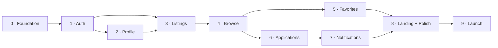

# Development Roadmap — Adopt-a-Pet

**Related docs:** [PRD.md](PRD.md) · [DATABASE.md](DATABASE.md) · [API.md](API.md) · [ARCHITECTURE.md](ARCHITECTURE.md)

---

## 1. How This Roadmap Is Built

Ten phases, each one a **vertical slice**: database → API → UI → deployed and clickable. No phase ends with "the backend is done but you can't see it." Every phase ends with something a person can open in a browser and use.

Each phase below lists:

- **Goal** — the one sentence that says why the phase exists
- **Deliverables** — split into Backend, Frontend, and Infrastructure
- **Requirements covered** — the `FR-` IDs from [PRD.md §5](PRD.md#5-functional-requirements)
- **Done when** — a checklist you can literally walk through to decide whether the phase is finished
- **Testing** — what to verify before moving on

### Build order, and why

| Ordering decision | Reason |
|---|---|
| **Foundation before everything** | Deploying an empty app on day one means every later phase is a small deploy, not a scary first one. Deployment problems found in week one are cheap; found in week eight they block launch. |
| **Auth before listings** | A pet has an owner. Without users there is no `owner_id`, so listings cannot be modeled correctly, and you'd build the ownership checks twice. |
| **Profile before listings** | The pet detail page shows an owner card. Building the profile first means the listing page has real data to render instead of a placeholder that gets replaced later. |
| **Listings before browse** | You cannot build a filter bar with nothing to filter. Create-first means the seed script and the browse page work against real rows. |
| **Browse before applications** | Applying starts on a pet detail page. That page has to exist and be reachable first. |
| **Favorites before applications** | Favorites is the simplest possible authenticated write — one join table, one toggle. It proves the auth-plus-mutation path end to end on something trivial, so when applications go wrong you know the plumbing isn't the cause. |
| **Applications before notifications** | Notifications are triggered *by* application events. Build the event, then the reaction. |
| **Landing page near the end** | It's a marketing page for a product whose features must exist first. Building it early means rewriting it once the real screens are settled. |

---

## Phase 0 — Foundation

**Goal:** A running skeleton, deployed, with the database connected — so every later phase is an increment, not a first attempt.

### Deliverables

**Infrastructure**
- Git repository, monorepo layout per [ARCHITECTURE.md §7](ARCHITECTURE.md#7-repository-layout)
- `docker-compose.yml` with Postgres 16
- `.env.example` for both surfaces; `.env` gitignored
- Render web service + Render Postgres created
- Vercel project created, root directory `frontend`
- GitHub Actions CI: lint + typecheck + build on every PR
- Cloudinary, Resend, and Sentry accounts created with keys in place

**Backend**
- FastAPI app with CORS, the error-envelope exception handler from [API.md §1.2](API.md#12-error-envelope), and router registration
- `config.py` using Pydantic Settings
- `database.py` with the engine, session factory, and `get_db` dependency
- SQLAlchemy models for **all** tables in [DATABASE.md §4](DATABASE.md#4-tables)
- Alembic wired up; migrations `0001`–`0006` written and applied
- `GET /api/v1/health` returning `{"status":"ok","database":"ok"}`
- `scripts/seed.py` per [DATABASE.md §9](DATABASE.md#9-seed-data-for-local-development)
- pytest configured with a test database fixture

**Frontend**
- Next.js 15 + TypeScript + Tailwind v4
- Design tokens from [PRD.md §8.1](PRD.md#81-design-direction) in `tailwind.config.ts`
- `lib/api.ts`: fetch wrapper with `credentials: "include"`, error-envelope parsing, and a refresh-on-401 hook (stubbed until Phase 1)
- `lib/types.ts` mirroring the API response objects
- Header/Footer shell, one placeholder page
- ESLint + Prettier

### Requirements covered
None directly — this is the substrate.

### Done when
- [ ] `docker compose up` starts Postgres; `alembic upgrade head` creates every table, enum, index, and trigger
- [ ] `python -m scripts.seed` loads 8 users and 30 pets without error
- [ ] `uvicorn app.main:app --reload` serves `/docs` with the health endpoint
- [ ] `npm run dev` serves the shell at `localhost:3000`
- [ ] The frontend can call `/health` through `lib/api.ts` with no CORS error
- [ ] Pushing to `main` deploys both surfaces; the deployed frontend reaches the deployed API's `/health`
- [ ] Opening a PR runs CI and it passes

### Testing
Health check passes locally and in production. Verify the schema by connecting with `psql` and running `\d+ pets` — confirm `age_months` is a generated column and the partial index on pending applications exists.

---

## Phase 1 — Authentication

**Goal:** A person can register, verify their email, log in, log out, and reset a forgotten password.

### Deliverables

**Backend**
- `core/security.py`: Argon2 hashing, JWT encode/decode, secure token generation, SHA-256 hashing for stored tokens
- `core/dependencies.py`: `get_current_user`, `get_current_user_optional`, `require_verified`
- `services/auth_service.py`: register, login, refresh with rotation, logout, verify, resend, forgot, reset
- `integrations/email_client.py`: Resend client + a shared HTML layout
- Email templates **E1** (verify) and **E2** (reset) from [PRD.md §7](PRD.md#7-email-notification-matrix)
- All nine endpoints in [API.md §3](API.md#3-authentication-endpoints)
- Cookie handling exactly per [API.md §1.6](API.md#16-auth-cookies)
- Rate limits on `/auth/login`, `/auth/register`, `/auth/forgot-password`, `/auth/resend-verification`

**Frontend**
- `/register`, `/login`, `/verify-email`, `/forgot-password`, `/reset-password`
- `AuthProvider` context hydrating from `GET /auth/me` on load
- `lib/api.ts` refresh-on-401 completed, with concurrent 401s sharing one in-flight refresh
- Route protection: unauthenticated users hitting a protected route are redirected to login and returned afterwards
- Header shows Log in / Register or the user menu depending on session
- "Verify your email" banner for logged-in unverified users, with a resend button

### Requirements covered
FR-AUTH-1 → FR-AUTH-8

### Done when
- [ ] Registering sends a real verification email that arrives
- [ ] The verification link verifies the account; a reused or expired link shows the error state with a working Resend
- [ ] Login sets both cookies; they are `HttpOnly` and `Secure` in production (check DevTools → Application → Cookies)
- [ ] Reloading the page keeps the user logged in
- [ ] After 15 minutes, the next request refreshes silently with no visible interruption
- [ ] Logout clears cookies and revokes the refresh row in the database
- [ ] Password reset works end to end and logs out every other session
- [ ] Wrong password and unknown email return the identical message
- [ ] An unverified user is blocked from verified-only actions with a clear message

### Testing
`pytest` covering: duplicate email → 409, wrong password → 401, expired token → 400, refresh rotation revokes the old row, reset revokes all refresh tokens. Manually check the raw `email_tokens` and `refresh_tokens` rows contain **hashes**, never raw tokens.

---

## Phase 2 — User Profile

**Goal:** Every user has a profile they can edit, with an avatar, and a public view that never leaks contact details.

### Deliverables

**Backend**
- `integrations/cloudinary_client.py`: signature generation and asset deletion
- All six endpoints in [API.md §4](API.md#4-profile-endpoints)
- Response schemas `UserPublic`, `UserPrivate`, `UserContact` as three distinct Pydantic models

**Frontend**
- `/dashboard/profile` — edit form with avatar uploader (direct Cloudinary upload, preview, replace)
- `/users/[id]` — public profile as a Server Component
- `UserCard` component, reused later on the pet detail page
- Dashboard shell with sidebar navigation (other sections stubbed)

### Requirements covered
FR-PROF-1 → FR-PROF-4 (FR-PROF-5 lands in Phase 6)

### Done when
- [ ] A user can update name, city, phone, and bio, and the values persist across reload
- [ ] Avatar upload goes browser → Cloudinary directly; the API only stores the URL
- [ ] Replacing an avatar deletes the old asset from Cloudinary
- [ ] `GET /users/{id}` response contains **no** `email` or `phone` field — verified by reading the raw JSON, not the UI
- [ ] Editing another user's profile is impossible; there is no endpoint that would allow it

### Testing
Test that `UserPublic` cannot serialize `email` even if a `User` model with an email is passed to it. Upload a 6 MB image and confirm it is rejected.

---

## Phase 3 — Pet Listings (CRUD + Images)

**Goal:** An owner can create a listing with photos, edit it, delete it, and see all their listings in one place.

### Deliverables

**Backend**
- `services/pet_service.py` — create with images in one transaction, update, delete with Cloudinary cleanup
- `services/image_service.py` — signature, add, delete with position renumbering, reorder
- `POST /pets`, `GET /pets/{id}`, `PATCH /pets/{id}`, `DELETE /pets/{id}`, `GET /pets/mine`
- All four image endpoints in [API.md §6](API.md#6-image-endpoints), including the pet-less create signature
- Ownership enforced in the service layer via a `require_owner` dependency
- Image count rules: minimum 1, maximum 8

**Frontend**
- `/pets/new` — sectioned form (Basics → Details → Photos → Description)
- `PhotoUploader`: multi-select, direct Cloudinary upload with per-file progress, thumbnail previews, remove, drag to reorder, cover indicator on the first image
- `/pets/[id]/edit` — same form, prefilled
- `/pets/[id]` — detail page with gallery, attribute grid, description, and the `UserCard` from Phase 2
- `/dashboard/listings` — rows with thumbnail, status badge, and Edit / Delete actions
- Delete confirmation modal naming the specific pet

### Requirements covered
FR-PET-1 → FR-PET-6 · FR-DISC-9 (partial — the Apply button arrives in Phase 6)

### Done when
- [ ] A verified user can create a listing with 3 photos and land on its detail page
- [ ] An unverified user is blocked with a message pointing at verification
- [ ] Submitting with 0 photos is rejected; a 9th photo is rejected
- [ ] Editing changes values without touching the images
- [ ] Deleting an image renumbers the rest so positions stay contiguous from 0; deleting the last image is refused
- [ ] Reordering changes the cover image on the detail page and in `/dashboard/listings`
- [ ] Another user opening `/pets/{id}/edit` gets a 403
- [ ] Deleting a listing removes the row and its Cloudinary assets

### Testing
Ownership tests on every mutating endpoint. Confirm a failed pet insert leaves no orphan `pet_images` rows (single transaction). Manually check the Cloudinary dashboard after a delete.

---

## Phase 4 — Browse, Filters, and Search

**Goal:** Anyone can find a pet — grid, filters, search, sort, pagination, all in the URL.

### Deliverables

**Backend**
- `GET /pets` with every query parameter in [API.md §5](API.md#5-pet-listing-endpoints): `species`, `size`, `gender`, `city`, `age_band`, `q`, `sort`, `page`, `limit`
- Full-text search using the GIN index over name + breed + description
- `age_band` mapped onto the generated `age_months` column
- `GET /meta/filters` with counts, cached 5 minutes
- Route registration order verified: `/pets/mine` before `/pets/{id}`
- Only `status = 'available'` in list results

**Frontend**
- `/pets` as a Server Component reading filters from `searchParams`
- `PetCard` matching the anatomy in [PRD.md §8.3](PRD.md#83-pet-card-anatomy), with Cloudinary transformation URLs for the 4:3 crop
- `PetGrid`: 4 / 2 / 1 columns responsive
- `FilterBar`: species as the primary always-visible control, then size, gender, city, age band; collapses to a bottom sheet under 640px
- Active filter chips with individual remove and "Clear all"
- Search input, debounced, writing to the URL
- Sort dropdown; pagination with page numbers
- Skeleton, empty, and error states per [PRD.md §8.6](PRD.md#86-state-handling)

### Requirements covered
FR-DISC-1 → FR-DISC-9

### Done when
- [ ] `/pets` shows only available pets, newest first
- [ ] Selecting a species updates results and the URL
- [ ] Copying the URL into a new tab reproduces the exact same results
- [ ] Browser back steps through filter states correctly
- [ ] Filters combine with AND; repeated values in one filter combine with OR
- [ ] Search matches text in name, breed, and description, and composes with active filters
- [ ] All three sorts behave correctly, including `youngest` across mixed months/years ages
- [ ] Pagination is correct on the last page and with an empty result set
- [ ] The empty state offers "Clear filters" and it works
- [ ] Skeletons match final card dimensions — no layout shift on load

### Testing
Test each filter in isolation and in combination. Verify with `EXPLAIN ANALYZE` that the browse query uses `idx_pets_browse`. Check the grid on a 375px viewport.

---

## Phase 5 — Favorites

**Goal:** Logged-in users can save pets and revisit them. The smallest possible authenticated mutation, proving the write path.

### Deliverables

**Backend**
- Three endpoints in [API.md §7](API.md#7-favorites-endpoints), both toggles idempotent
- `is_favorited` populated on `PetCard` and `PetDetail` for authenticated callers

**Frontend**
- `FavoriteButton` with optimistic update and rollback on failure
- Present on cards and the detail page
- `/dashboard/favorites` reusing `PetGrid`
- Logged-out click → redirect to login → return to the same page

### Requirements covered
FR-FAV-1 → FR-FAV-5

### Done when
- [ ] The heart toggles instantly and persists across reload
- [ ] Double-clicking rapidly does not create duplicate rows (unique constraint holds)
- [ ] Logged-out click redirects to login and returns to the originating page
- [ ] The saved list shows newest-saved first, including adopted pets with the correct badge
- [ ] Unfavoriting from the saved list removes the card without a full reload
- [ ] No endpoint anywhere exposes who favorited a pet

### Testing
Concurrent favorite requests for the same pair → exactly one row. Confirm `is_favorited` is `false` for anonymous callers rather than absent.

---

## Phase 6 — Adoption Applications

**Goal:** The core transaction — an adopter applies, the owner reviews, accepts one, and the pet is adopted.

### Deliverables

**Backend**
- `services/application_service.py` including the accept transaction from [DATABASE.md §7](DATABASE.md#7-the-accept-transaction) with `SELECT … FOR UPDATE` on the pet row
- All six endpoints in [API.md §8](API.md#8-adoption-application-endpoints)
- `POST /pets/{id}/mark-adopted`
- Contact release: `UserContact` returned only on accepted applications, to the two parties only
- Non-parties receive `404`, not `403`
- Guards: cannot apply to own pet, cannot apply twice, cannot apply to an adopted pet, cannot decide a non-pending application

**Frontend**
- `ApplicationForm` on the pet detail page
- Apply button states per FR-DISC-9: Apply / Sign in to apply / Verify to apply / Already applied (status) / View applications (owner) / This pet has been adopted
- `/pets/[id]/applications` — applicant cards with full answers, Accept and Reject
- Accept confirmation modal explaining that it rejects everyone else and closes the listing
- `/dashboard/applications` — adopter's list with status badges; accepted rows expand to show owner contact
- `application_count` and `pending_count` badges on `/dashboard/listings`

### Requirements covered
FR-APP-1 → FR-APP-9 · FR-PET-7 · FR-PROF-5

### Done when
- [ ] An adopter can submit an application and it appears in the owner's inbox
- [ ] Applying to your own pet is impossible from the UI and rejected by the API
- [ ] A second application to the same pet returns `409` and the UI shows the existing status
- [ ] Accepting sets that application `accepted`, all other pending on that pet `rejected`, and the pet `adopted` — in one transaction
- [ ] The adopted pet disappears from `/pets` but its direct link still resolves
- [ ] The accepted adopter sees the owner's phone and email; rejected adopters see neither
- [ ] Two owners' browser tabs accepting different applications simultaneously → one succeeds, the other gets `400 APPLICATION_ALREADY_DECIDED`
- [ ] A third user requesting an application ID gets `404`
- [ ] `mark-adopted` rejects all pending applications

### Testing
This is the highest-risk phase — test it hardest. Concurrency test on the accept path with two simultaneous requests. Verify the response JSON on a pending application contains no contact fields at all. Test the full lifecycle with the seeded pet that has four pending applications.

---

## Phase 7 — Notifications

**Goal:** Both sides are told what happened, by email and in the app.

### Deliverables

**Backend**
- Email templates **E3**–**E6** from [PRD.md §7](PRD.md#7-email-notification-matrix)
- `services/notification_service.py` — writes the notification row inside the event transaction, queues the email after commit via `BackgroundTasks`
- Wired into: application submitted, accepted, rejected, pet adopted
- Four endpoints in [API.md §9](API.md#9-notification-endpoints)
- Email failures logged, never propagated to the caller

**Frontend**
- `NotificationBell` in the header with unread count, polled on route change
- Dropdown listing recent notifications, each linking to its target
- Clicking marks read and navigates; "Mark all read" action
- Empty state for no notifications

### Requirements covered
FR-NOTIF-1 → FR-NOTIF-4

### Done when
- [ ] All six emails render correctly in Gmail and on mobile, with working links
- [ ] Accepting one of four applications sends exactly: 1 × E4, 3 × E5, 1 × E6
- [ ] Every email link opens the correct page in the correct environment
- [ ] The bell badge reflects unread count and clears correctly
- [ ] A forced email-provider failure logs the error and still completes the API request successfully
- [ ] Notification rows and emails never disagree (rows are written in-transaction, emails after commit)

### Testing
Force a Resend failure by using a bad API key and confirm accept still succeeds. Verify no email is sent when the transaction rolls back.

---

## Phase 8 — Landing Page and Design Polish

**Goal:** The product looks finished and works on a phone.

### Deliverables

**Frontend**
- `/` landing page, all seven sections from [PRD.md §8.2](PRD.md#82-landing-page-structure)
- Species quick-filter tiles deep-linking into pre-filtered `/pets`
- Featured pets pulling the 8 most recent available listings
- Full responsive pass at 375 / 768 / 1440
- Every list view given real loading, empty, and error states
- Consistent buttons, inputs, badges, and modals across all pages
- Keyboard navigation, visible focus rings, alt text on every pet image, labels on every input
- 404 and error boundary pages
- `next/image` everywhere with Cloudinary `f_auto,q_auto`
- Page titles and Open Graph tags, especially on pet detail (shared links should preview the pet photo)

### Requirements covered
F12 · [PRD.md §8](PRD.md#8-ux-and-design-notes) in full

### Done when
- [ ] Landing page renders correctly at all three breakpoints
- [ ] Species tiles land on correctly pre-filtered browse results
- [ ] Every page has been walked through on a 375px viewport
- [ ] Every interactive element is keyboard reachable with a visible focus ring
- [ ] No layout shift on image load anywhere
- [ ] Sharing a pet link in WhatsApp shows the pet's photo and name
- [ ] Lighthouse ≥ 90 on performance and accessibility for landing, browse, and detail

### Testing
Full click-through of both personas' journeys on a real phone. Screen-reader pass over the pet card and the application form.

---

## Phase 9 — Launch

**Goal:** Production is real, monitored, and safe to send people to.

### Deliverables

**Infrastructure**
- Render upgraded to paid Starter for the API and Postgres — **no sleeping production service**
- Custom domain on Vercel; API subdomain on Render; HTTPS verified
- Production secrets rotated and distinct from staging
- `CORS_ORIGINS` narrowed to the production domain
- Resend sending domain verified with SPF/DKIM
- Sentry release tagging on both surfaces
- Daily database backups confirmed, and a restore actually tested once

**Product**
- `robots.txt` and a dynamic `sitemap.xml` including every available pet
- Privacy Policy and Terms pages
- Analytics on the landing page
- Seed data cleared from production

**Verification**
- Full end-to-end pass on production with two real accounts
- Every email delivered to a real inbox, not a spam folder

### Done when
- [ ] Both personas' full journeys complete on production without a workaround
- [ ] No cold-start delay on the landing page
- [ ] All six emails land in the inbox from the verified domain
- [ ] Sentry receives a deliberately triggered test error from both surfaces
- [ ] A database backup has been restored to a scratch instance successfully
- [ ] A pet detail URL is indexable and previews correctly when shared
- [ ] No test or seed data remains in production

---

## 2. Beyond v1

Deliberately out of scope for the initial build. Listed here so the v1 schema doesn't accidentally block them.

| Version | Feature | Notes |
|---|---|---|
| v1.5 | **Admin surface** | The gap FastAPI leaves versus Django. Either admin-scoped endpoints plus a Next.js page, or point Metabase at the database. |
| v1.5 | **In-app messaging** | Owner ↔ adopter thread after an application is submitted. Adds a `messages` table and a moderation surface. |
| v1.5 | **Reporting and moderation** | Report a listing or user; a queue for reviewing reports. |
| v1.5 | **Listing expiry** | Nudge at 30 days, auto-hide at 60, keeping the catalog fresh. Needs a scheduled job — the first thing that would justify a real worker. |
| v2 | **Saved searches with alerts** | "Email me when a cat under 2 years is listed in Pune." |
| v2 | **Map and radius search** | Requires replacing free-text `city` with geocoded coordinates and PostGIS. |
| v2 | **Shelter / organization accounts** | Multi-user teams, verification badges. Would introduce a real role system. |
| v2 | **Adoption stories** | Post-adoption follow-up and a testimonial wall — the strongest available trust signal. |
| v2 | **PWA** | Installable, with share-to-WhatsApp deep links. |

**The one v1 decision that keeps these open:** `application_status` already includes `withdrawn`, and `notification_type` is an enum that extends cleanly. Neither needs a migration-heavy rework to support the above.

---

## 3. Risks

| Risk | Impact | Mitigation |
|---|---|---|
| The accept transaction is subtly wrong under concurrency | Two adopters both told they got the pet | `SELECT … FOR UPDATE` on the pet row, plus an explicit concurrency test in Phase 6 |
| Contact details leak before acceptance | Direct breach of the product's core trust promise | Enforced by response schema (`UserPublic` has no such field), not by conditional logic. Verified by reading raw JSON in Phase 2 and Phase 6. |
| Render free tier used in production | 45-second cold start on the landing page | Explicit paid upgrade in Phase 9's checklist |
| Cloudinary assets orphaned when a DB write fails | Storage fills with unreferenced images | Pet and images inserted in one transaction; deletes clean up Cloudinary. Low volume makes residual orphans harmless in v1. |
| Emails land in spam | Users never verify, and the funnel dies at step one | Verified sending domain with SPF/DKIM in Phase 9, tested against a real inbox |
| Alembic autogenerate silently drops enum or trigger changes | Production schema diverges from the models | Documented rule: every generated migration is read and edited before commit |
| Scope creep from the v1.5/v2 list | v1 never ships | The phase checklists are the contract. Anything not in a "Done when" list is out. |

---

## 4. Testing Approach

| Layer | Tool | What it covers |
|---|---|---|
| Backend unit | pytest | Service functions in isolation: token generation, age normalization, filter query building |
| Backend integration | pytest + a test Postgres | Every endpoint against a real database — auth, ownership, transactions, error codes |
| Concurrency | pytest with parallel clients | The accept transaction and the favorite toggle |
| Frontend typecheck | `tsc --noEmit` | Types in `lib/types.ts` match what the API actually returns |
| Frontend lint | ESLint | |
| Manual | Checklists in this document | Every "Done when" item, walked through in a browser |

**Not in v1:** end-to-end browser automation. At this size the manual checklists cover the same journeys at a fraction of the setup cost. Revisit if the "Done when" passes start taking more than an hour.

**The rule that matters:** a phase is not finished until every one of its "Done when" boxes is ticked in a browser, against the deployed environment — not just locally.
